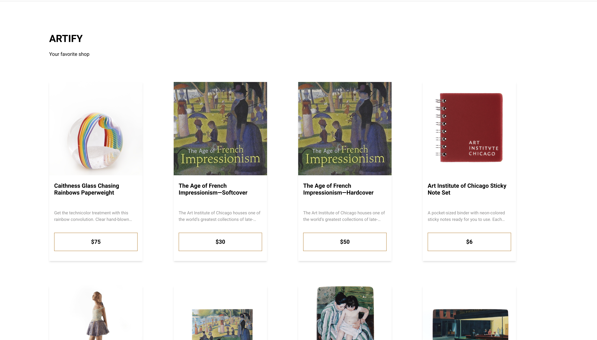

# Artify

This application is a simple interface which uses the public API for the Art Institute of Chicago, to display a paginated catalogue of products from their shop.

The Application is built using mainly

* [ReactJS](https://reactjs.org/)
* [Redux](https://redux.js.org/)
* [SCSS](https://github.com/sass/node-sass)
* [Typescript](https://www.typescriptlang.org/)

## Work progress
* Built a simple one page application which displays a list of products and their prices.
* Shows a load more button which displays more products when clicked.
* Responsiveness for tablet and mobile screens.

## App

A picture sample of the final app can be seen below:

# Development

### Running the project

In order to run this project on your local machine:
* Clone the repository with the following command `git clone https://github.com/Cressence/artify.git`
* Move to the project folder with the following command `cd artify`
* Install dependencies using YARN `yarn install` or NPM `npm install`
* Run the project using YARN `yarn run start` or NPM `npm run start`

## Difficulties

* Building a pagination component to display the number pages available as well as the pagination steps. So I moved on to using a load more button to handle pagination.

## Future Work/Possible Improvements

* Add test coverage.
* Improve on the UI design.
* Build a pagiantion component where users can click on specific pages and be redirected to the desired page.
* Smoothly display errors from the API.

## Author

* Github: [@Cressence](https://github.com/Cressence)
* LinkedIn: [@yakam-cressence-685b55134](https://www.linkedin.com/in/yakam-cressence/)